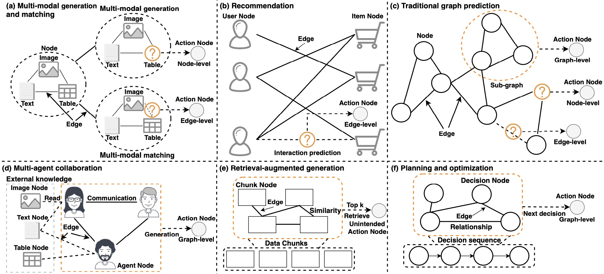
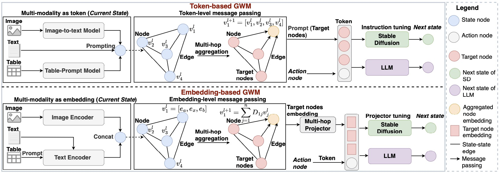

# Graph World Model

<p align="center">
    <a href="https://ulab-uiuc.github.io/GraphRouter/">
        
    </a>
    <a href="https://arxiv.org/pdf/2507.10539">
        
    </a>
    <a href="https://github.com/ulab-uiuc/GWM/blob/master/LICENSE">
        
    </a>
    <br>
    <a href="https://github.com/ulab-uiuc/GWM">
        
    </a>
    <a href="https://github.com/ulab-uiuc/GWM">
        
    </a>
    <a href="https://github.com/ulab-uiuc/GWM">
        
    </a>
</p>


<p align="center">
    <a href="https://ulab-uiuc.github.io/GWM/">🌐 Project Page</a> |
    <a href="https://arxiv.org/pdf/2507.10539">📜 arXiv</a> |
<p>


<!-- Applicable Scenarios Section -->
<h3 align="center">📌 Applicable Scenarios</h3>

<p align="center">
  GWM covers six scenarios: multi-modal generation and matching, recommendation systems, graph prediction, multi-agent collaboration, retrieval-augmented generation, and planning and optimization. It represents different entities and their interactions as graph nodes and edges, enabling unified modeling across these tasks.
</p>

<div align="center">
  
</div>

<br/>

<!-- Method Section -->
<h3 align="center">🧠 Method</h3>

<p align="center">
GWM models world states as graphs with multi-modal nodes and defines actions at node, edge, and graph levels, enabling state updates through intended and unintended actions.
</p>

<div align="center">
  
</div>


## News


**[2025.01.22]** 🌟 **Graph World Model** is accepted for ICML 2025.


## 📌Preliminary


### Environment Setup

```shell
# create a new environment
conda create -n gwm python=3.10
conda activate gwm

# install pytorch. Modify the command to align with your own CUDA version.
pip3 install torch  --index-url https://download.pytorch.org/whl/cu118

# install related libraries
pip install -r requirements.txt

# install flash-attn
pip install flash-attn --no-build-isolation

# install pyg
pip install torch_geometric
pip install pyg_lib torch_scatter torch_sparse torch_cluster torch_spline_conv -f https://data.pyg.org/whl/torch-2.1.0+cu118.html

```

### Dataset Preparation

You can download the [multi_modal_data](link) from the provided links. Put the datasets into the `multi_modal_data/` folder like below:

```
$CODE_DIR
├── model
├── multi_modal_data
│   ├── agent
│   ├── goodreads
│   ├── multimodal_paper
│   ├── optimization
│   ├── rag
│   ├── recommendation
│   │   ├── baby
│   │   ├── clothing
│   │   └── sports
│   └── traditional_graph
│       ├── cora
│       ├── HIV
│       └── pubmed
└── gwm_e
```

Inside each leaf directory of multi_modal_data, there are three files: train_node/edge/graph_data.jsonl, test_node/edge/graph_data.jsonl, and multi_hop_graph_embedding.pt. Specifically, the `.pt` file is the embedding file and the `.jsonl` files indicate the training/testing data samples. Each row corresponds to one data sample in a dictionary format:

```json
{
 "id": [59],
 "conversations": [
   {
     "from": "human", 
     "value": "What is the correct answer to this question: A 23-year-old man presented with a 1-month history of double vision and right eyelid drooping that worsened at the end of the day..."
   },
   {
     "from": "gpt",
     "value": "E"
   }
 ],
 "graph": 1
}
```
"id" indicates the corresponding rows in the embedding file, "conversations" contains the prompt and its corresponding label, and "graph" serves as an indicator for utilizing graph tokens.

## ⭐Experiments

### Training and Evaluation

Run experiments and save the checkpoint.


```bash
deepspeed --num_gpus=3 gwm_e/train.py --tune_mm_mlp_adapter True --deepspeed ../scripts/zero2.json --mm_use_graph_start_end False --mm_use_graph_patch_token False --bf16 True --num_train_epochs 1 --per_device_train_batch_size 10  --per_device_eval_batch_size 4 --gradient_accumulation_steps 1 --evaluation_strategy "no" --save_strategy "epoch" --learning_rate 3e-4 --weight_decay 0. --warmup_ratio 0.03 --lr_scheduler_type "cosine" --logging_steps 1 --tf32 True --gradient_checkpointing True --lazy_preprocess True --report_to wandb
```


## 📝 Acknowledgement

The implementation of **GWM** is built upon [LLaGA](https://github.com/VITA-Group/LLaGA) and [LLaVA](https://github.com/haotian-liu/LLaVA).

We sincerely appreciate the efforts of these teams for their contributions to open-source research and development.

## Citation

```bibtex
@inproceedings{fenggraph,
  title={Graph World Model},
  author={Feng, Tao and Wu, Yexin and Lin, Guanyu and You, Jiaxuan},
  booktitle={Forty-second International Conference on Machine Learning}
}
```


<!-- <picture>
<source media="(prefers-color-scheme: dark)" srcset="https://api.star-history.com/svg?repos=ulab-uiuc%2FGraphEval&theme=dark&type=Date">

</picture> -->
